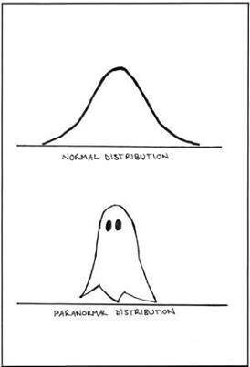

```{r setup, include=FALSE}
knitr::opts_chunk$set(echo = TRUE)
library(knitr)
library(kableExtra)
```


# {.tabset}

## Markdown
  
  
### R Markdown Dokument
  
Das hier ist ein *R Markdown* Dokument. Es kann R Code ausführen und die Ergebnisse darstellen. Damit lassen sich z.B. automatisierte Berichte erzeugen, die mit neuen Daten vorgefertige Analysen ausführen.
  
  
### Formatierung
  
Mit ein paar einfachen Tricks kann man ein schönes und ev. interaktives **HTML- oder pdf-Dokument** erstellen.  
Z.B. mit `# Überschrift` bzw. `## Überschrift` kann man Überschriften in unterschiedlicher Größe erzeugen.  
  
  
### Bilder
  
Es lassen sich auch Bilder integrieren.  
{width=20%}
<!-- im Codeblock: knitr::include_graphics(). -->
  
  
### Codeblöcke
  
Man kann Codeblöcke anzeigen:  

```{r, include=T, eval=T, echo=T}
# Das ist ein R Codeblock
# Der Code hier funktioniert und liefert einen Output

radius <- 3
flaeche <- radius ^ 2 * pi

```
Ein Kreis mit Radius `r radius`cm hat die Fläche `r flaeche`cm².

### Schöne Tabellen
```{r, include=T, eval=T, echo=F}
kable_styling(kable(head(iris)), bootstrap_options = c("striped", "hover", "condensed", "responsive"), latex_options = "HOLD_position") 
```
  

  
## Beispieldatensatz
  
### Iris Beispieldaten
  
Der 'iris' Datensatz beinhaltet 150 Messungen der Blattlängen und -breiten von 3 verschiedenen Lilienspezies.  
Er ist in RStudio integriert und kann direkt verwendet werden.  
  
Sepal und Petal sind verschiedene Blattarten:  
  

  
.  
  
Ein erster Überblick über die Daten:

```{r, include=T, eval=T, echo=T}

# head() zeigt die ersten 6 Reihen oder Einzelwerte an:
head(iris)
```

```{r, include=T, eval=T, echo=T}

# summary() berechnet für jede Spalte Minimum, Maximum, Quartile, Mean, Median:
summary(iris)
```

```{r, include=T, eval=T, echo=T}

# str() zeigt die Datenstruktur der Variablen an
str(iris)
```
  


## Grafiken

### Grafiken

In R kann man schnell und einfach Grafiken erstellen:

```{r, include=T, eval=T, echo=T}
plot(x=iris$Sepal.Width, y=iris$Petal.Width)
```
  
Mit zusätzlichen Argumenten in der Funktion kann man die Graphik verschönern und erweitern:  

```{r, include=T, eval=T, echo=T}

plot(x=iris$Sepal.Width, y=iris$Petal.Width, 
     col=c("red","blue","green")[iris$Species], # nach Spezies einfärben
    xlab="Breite Sepal", ylab="Breite Petal", main="Breite von Petal und Sepal") # Beschriftung

```

<!-- Mit dem Package 'plotly' sind auch interaktive Grafiken möglich:   -->

<!-- ```{r, include=T, eval=T, echo=T, message=F, warning=F} -->

<!-- #library(plotly) -->
<!-- #plot_ly(data = iris, x = ~Sepal.Width, y = ~Petal.Width, color = ~Species) -->


<!-- ``` -->

<!-- Oder 3D:   -->

<!-- ```{r, include=T, eval=T, echo=T, message=F, warning=F} -->

<!-- #plot_ly(data = iris, x = ~Sepal.Width, y = ~Petal.Width, z = ~Sepal.Length, color = ~Species) -->


<!-- ``` -->


  
  
## Shiny Apps

### Shiny Apps

Shiny Apps sind browserbasierte Programme mit graphischer Nutzeroberfläche, die sich relativ leicht und schnell erstellen lassen.   
Ein Beispiel: <https://shiny.rstudio.com/gallery/kmeans-example.html>.


## Machine Learning

### Machine Learning

Viele Algorithmen für maschinelles Lernen sind in R verfügbar. Z.B. random forest, eine Erweiterung von Decision Trees für Klassifizierung oder Regression. 


```{r, include=T, eval=T, echo=T, message=F, warning=F}

library(randomForest)

rf <- randomForest(Species ~ ., data=iris)
# Das Modell sagt anhand der Maße der Blätter die Spezies voraus
rf

predict(rf, iris[75, 1:4]) # Vorhersage für Zeile 75 anhand des Modells
iris[75, 5] # Wahre Klasse in Zeile 75

```


<!-- Zeug zum Rauskopieren

```{r, echo=T, eval=T, include=T}


```

So sieht Code im Text aus: `code`  
Bilder: 
Links: [bla](link)
*kursiv*
**fett**
Tabelle in R Block: kable_styling(kable(head(iris)), bootstrap_options = c("striped", "hover", "condensed", "responsive"))

Ausklappbox:

<details>
  <summary><i>Ausklappbox</i></summary>
    <p>Das ist eine Ausklappbox.</p>
</details>


Fuer Regenbogentext das hier in style rein (mit jeweiligem element, wie p):
p {
          background: linear-gradient(to right, orange , yellow, green, cyan, blue, violet);
          -webkit-background-clip: text;
          -webkit-text-fill-color: transparent;
}


<br>

Datum:

format(Sys.time(), '%d.%m.%Y')
'`r format(Sys.time(), '%d.%m.%Y')`'

 --> 